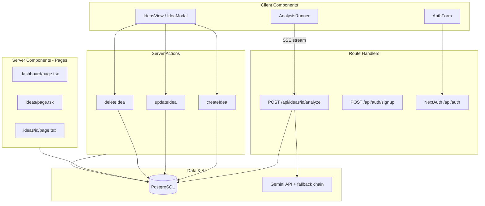

# LaunchLens

**LaunchLens** is an AI-powered startup idea validation workspace. Founders add concepts, run structured validation (risks, competitors, market potential, MVP features), and track scores on a dashboard.

Built with **Next.js 16** (App Router), **React 19**, **Prisma**, **PostgreSQL** (Neon), **NextAuth.js**, and the **Google Gemini API**.

---

## Table of contents

- [Features](#features)
- [Tech stack](#tech-stack)
- [Architecture overview](#architecture-overview)
- [Why Server Components for pages](#why-server-components-for-pages)
- [Why Server Actions for CRUD](#why-server-actions-for-crud)
- [Why a Route Handler for AI validation (not a Server Action)](#why-a-route-handler-for-ai-validation-not-a-server-action)
- [Gemini model fallback (free-tier quota)](#gemini-model-fallback-free-tier-quota)
- [CRUD operations](#crud-operations)
- [Authentication](#authentication)
- [Project structure](#project-structure)
- [Getting started](#getting-started)
- [Example ideas for testing](#example-ideas-for-testing)
- [Environment variables](#environment-variables)
- [Scripts](#scripts)
- [Deployment](#deployment)

---

## Features

- **Ideas workspace** — create, edit, and delete startup concepts with industry, audience, and market metadata
- **AI validation** — two-phase analysis: web-grounded research, then structured JSON report (score, risks, competitors, MVP)
- **Dashboard** — portfolio stats, top ideas by score, pending validations
- **Model fallback** — automatic switch across Gemini models when one hits quota or capacity limits (designed for free tier)
- **Streaming UI** — live progress, source titles, and active model badge during validation
- **Auth** — email/password with bcrypt; session-protected app routes

---

## Tech stack

| Layer | Choice |
|--------|--------|
| Framework | Next.js 16 (App Router) |
| UI | React 19, Tailwind CSS 4, shadcn/ui |
| Database | PostgreSQL via Prisma (Neon-friendly `directUrl`) |
| Auth | NextAuth.js (Credentials provider, JWT sessions) |
| AI | `@google/genai` (Gemini 2.x), Google Search grounding |
| Validation | Zod |

---

## Architecture overview



**Pattern in short:**

| Concern | Approach |
|---------|----------|
| Read data for UI | **Server Components** (pages fetch in `async` page components) |
| Mutate ideas (CRUD) | **Server Actions** (`app/(core)/ideas/actions.ts`) |
| Long-running AI stream | **Route Handler** + SSE (`app/api/ideas/[id]/analyze/route.ts`) |
| Sign up | **Route Handler** (`app/api/auth/signup/route.ts`) |
| Sign in | **NextAuth** client `signIn()` + server `authorize()` |

---

## Why Server Components for pages

Protected pages under `app/(core)/` are **async Server Components**. They load data on the server and pass serializable props to client views.

**Examples:**

- `app/(core)/dashboard/page.tsx` — loads ideas + latest analysis scores for stats
- `app/(core)/ideas/page.tsx` — lists all ideas for the signed-in user
- `app/(core)/ideas/[id]/page.tsx` — loads one idea and its analyses for the detail view

**Why this choice:**

1. **Security** — `GEMINI_API_KEY`, database URLs, and Prisma queries never ship to the browser. Only the signed-in user’s data is fetched server-side (`where: { userId }`).
2. **Performance** — No “load → spin → fetch” waterfall on the client for initial page data. HTML arrives with content (or with `loading.tsx` skeletons during navigation).
3. **Simplicity** — No React Query / SWR for the default case; `revalidatePath` after mutations keeps lists fresh.
4. **SEO & metadata** — `generateMetadata` on the idea detail page uses the real title/description from the database.
5. **Auth gate in one place** — `app/(core)/layout.tsx` calls `getServerSession` once and redirects unauthenticated users to `/auth`.

Client components (`IdeasView`, `AnalysisRunner`, `DashboardView`) handle interactivity only; they receive **already-fetched** props from server parents.

**Loading states:** `app/(core)/loading.tsx` and `app/(core)/dashboard/loading.tsx` show skeletons while server pages resolve after navigation (e.g. after sign-in).

---

## Why Server Actions for CRUD

Idea **create**, **update**, and **delete** live in `app/(core)/ideas/actions.ts` with `"use server"`.

**Why not REST API routes for CRUD?**

| Server Actions | Separate `/api/ideas` routes |
|----------------|------------------------------|
| Called directly from forms/modals (`createIdea`, `updateIdea`, `deleteIdea`) | Extra boilerplate: fetch, JSON parsing, error shapes |
| Type-safe inputs via shared Zod schemas (`lib/zod.ts`) | Duplicate validation on client and server |
| `revalidatePath("/ideas")` / `revalidatePath("/dashboard")` built in | Manual cache invalidation or client refetch |
| Session checked inside the action with `getServerSession` | Same check, but more files |

Server Actions fit **short, transactional mutations** tied to UI forms. They run only on the server, respect the same auth rules as pages, and integrate with Next.js cache revalidation.

**Flow:**

1. User submits `IdeaModal` (client component).
2. Client calls `await createIdea(payload)` or `updateIdea(id, payload)`.
3. Server validates with `ideaSchemas`, writes via Prisma scoped to `session.user.id`.
4. `revalidatePath` refreshes server-rendered lists without a full page reload.

---

## Why a Route Handler for AI validation (not a Server Action)

Validation uses **`POST /api/ideas/[id]/analyze`** and streams **Server-Sent Events (SSE)** to `AnalysisRunner`.

**Why not a Server Action here?**

1. **Streaming** — Analysis runs for tens of seconds with multiple phases (search → generate → save). SSE gives incremental `status`, `delta`, `sources`, `model`, and `complete` events. Route Handlers expose a `ReadableStream` response; Server Actions are a poor fit for long-lived streams to the client.
2. **Rate limiting** — The route returns `429` if the same idea was analyzed within 3 minutes.
3. **Clear HTTP semantics** — Auth errors (`401`), not found (`404`), and stream errors are easy to handle in the client `fetch` + `ReadableStream` loop.

Server Actions for CRUD; Route Handler for **long-running, streaming AI work**.

---

## Gemini model fallback (free-tier quota)

Google’s free tier applies **per-model** limits (RPM, TPM, RPD). When `gemini-2.5-flash` is exhausted or returns **503 / UNAVAILABLE**, validation should not fail immediately—it should try the next model in the chain.

### Configuration

Defined in `lib/gemini.ts`:

```ts
export const ANALYSIS_MODEL_CHAIN = [
  { id: "gemini-2.5-flash", label: "Gemini 2.5 Flash" },
  { id: "gemini-2.5-flash-lite", label: "Gemini 2.5 Flash Lite" },
  { id: "gemini-2.0-flash", label: "Gemini 2.0 Flash" },
  { id: "gemini-2.0-flash-lite", label: "Gemini 2.0 Flash Lite" },
];
```

Order matters: best quality first, then lighter models that often still have free-tier headroom.

### How it works

Implemented in `lib/analysis/run-analysis.ts` and `lib/analysis/model-errors.ts`:

1. **Research phase** — Gemini + Google Search grounding; stream notes to the UI.
2. **Structured phase** — JSON schema output (validation score, risks, competitors, MVP).
3. On failure, if `shouldFallbackToNextModel(error)` is true (quota **429** or overload **503**), restart both phases with the **next** model.
4. Emit SSE `model` events so the UI shows `Model: …` or `Fallback: …`.
5. If every model fails, `formatAnalysisError` returns a **friendly free-tier message** (not raw API JSON).

| Error type | Behavior |
|------------|----------|
| 503 / high demand | Try next model |
| 429 / quota on current model | Try next model |
| All models exhausted | User-facing quota message + link to [rate limits](https://ai.dev/rate-limit) |

**Important:** Listing a model in the API does not mean it has quota. Check **Google AI Studio → Rate limits** and adjust `ANALYSIS_MODEL_CHAIN` to match your project.

---

## CRUD operations

### Data model (Prisma)

| Model | Purpose |
|-------|---------|
| `User` | Account (`email`, `passwordHash`, `name`) |
| `Idea` | Startup concept owned by a user |
| `Analysis` | AI validation run linked to an idea (JSON fields for risks, competitors, etc.) |

Relations: `User` → many `Idea` → many `Analysis` (cascade delete).

### Operations

| Action | Server Action | Validation | Auth | Cache |
|--------|---------------|------------|------|-------|
| **Create** | `createIdea(values)` | `ideaSchemas.create` (Zod) | `session.user.id` on `userId` | `revalidatePath` `/ideas`, `/dashboard` |
| **Read (list)** | — (Server Component) | — | `ideas/page.tsx` filters by `userId` | — |
| **Read (one)** | — (Server Component) | — | `ideas/[id]/page.tsx` `findFirst` with `userId` | — |
| **Update** | `updateIdea(ideaId, values)` | `ideaSchemas.update` | `where: { id, userId }` | `revalidatePath` `/ideas`, `/ideas/[id]` |
| **Delete** | `deleteIdea(ideaId)` | `ideaSchemas.delete` | `where: { id, userId }` | `revalidatePath` `/ideas`, `/dashboard` |

**Create** returns `{ id }` so the client can redirect to `/ideas/[id]` after the first save.

**Delete** is triggered from `IdeasView` (per-card action).

**Update / create** use the shared `IdeaModal` form; schemas live in `lib/zod.ts` (`create` vs `createClient` for comma-separated audiences in the UI).

### Analysis (not CRUD on ideas, but related)

| Action | Endpoint | Notes |
|--------|----------|-------|
| **Run validation** | `POST /api/ideas/[id]/analyze` | Creates `Analysis` row on success; 3-minute cooldown per idea |

---

## Authentication

| Flow | Implementation |
|------|----------------|
| Sign up | `POST /api/auth/signup` — bcrypt hash (12 rounds), Zod validation |
| Sign in | NextAuth Credentials → `lib/auth.ts` `authorize()` |
| Session | JWT; `session.user.id` for all data access |
| Protected routes | `app/(core)/layout.tsx` redirects to `/auth` if no session |

**Production:** Set `NEXTAUTH_URL` to your deployed URL (e.g. `https://your-app.vercel.app`) and `NEXTAUTH_SECRET`. Production uses a **separate** database from local dev—create an account on the live site.

---

## Project structure

```
app/
  (core)/                 # Authenticated app (Server Components + layout)
    dashboard/
    ideas/
      actions.ts          # Server Actions: create, update, delete
      [id]/page.tsx
    layout.tsx            # Session gate + AppShell
    loading.tsx
  api/
    auth/                 # NextAuth + signup
    ideas/[id]/analyze/   # SSE validation stream
  auth/                   # Sign-in / sign-up UI
components/
  ideas/                  # IdeasView, IdeaModal, AnalysisRunner, …
  dashboard/
lib/
  analysis/               # Prompts, schema, run-analysis, model-errors
  gemini.ts               # Model chain + client factory
  auth.ts
  zod.ts
prisma/
  schema.prisma
scripts/
  list-gemini-models.mjs
```

---

## Getting started

### Prerequisites

- Node.js 20+
- PostgreSQL (e.g. [Neon](https://neon.tech))
- [Gemini API key](https://aistudio.google.com/apikey)

### Install and run

```bash
npm install
cp .env.example .env   # fill in values
npx prisma migrate dev
npm run dev
```

Open [http://localhost:3000](http://localhost:3000).

### Example ideas for testing

Use these when creating ideas in the app (**New idea**) or to exercise AI validation. Copy the fields into the form.

#### MeetingMind

| Field | Value |
|-------|--------|
| **Title** | MeetingMind |
| **Description** | An AI assistant that automatically joins meetings, generates summaries, extracts action items, updates project management tools, tracks commitments, and follows up on overdue tasks. |
| **Industry** | Productivity SaaS |
| **Target audience** | Remote Teams, Startups, Project Managers, Enterprise Teams |
| **Primary target market** | Global |

#### TutorLoop

| Field | Value |
|-------|--------|
| **Title** | TutorLoop |
| **Description** | A marketplace that matches K–12 students with vetted tutors for live video sessions, with AI-generated practice plans between lessons and parent progress dashboards. |
| **Industry** | EdTech |
| **Target audience** | Students, Parents, Private Tutors |
| **Primary target market** | India |

#### EcoTrack

| Field | Value |
|-------|--------|
| **Title** | EcoTrack |
| **Description** | B2B software that helps mid-size manufacturers measure scope 1–3 emissions, generate compliance reports, and recommend operational changes with estimated cost savings. |
| **Industry** | Climate Tech |
| **Target audience** | Sustainability Managers, Operations Leads, CFOs |
| **Primary target market** | European Union |

#### LocalFeast

| Field | Value |
|-------|--------|
| **Title** | LocalFeast |
| **Description** | Hyperlocal meal subscriptions from home chefs in your neighborhood—curated weekly menus, allergen filters, and same-day delivery within a 5 km radius. |
| **Industry** | Food & Beverage |
| **Target audience** | Urban Professionals, Families, Home Cooks |
| **Primary target market** | United States |

#### DevPulse

| Field | Value |
|-------|--------|
| **Title** | DevPulse |
| **Description** | Developer analytics that connects GitHub, Jira, and incident tools to surface cycle-time bottlenecks, flaky-test trends, and sprint risk scores for engineering managers. |
| **Industry** | Developer Tools |
| **Target audience** | Engineering Managers, Platform Teams, CTOs |
| **Primary target market** | Global |

---

## Environment variables

| Variable | Required | Description |
|----------|----------|-------------|
| `DATABASE_URL` | Yes | Postgres connection (pooled URL for Neon) |
| `DIRECT_URL` | Yes* | Direct URL for Prisma migrations (`prisma migrate deploy` on build) |
| `NEXTAUTH_SECRET` | Yes | `openssl rand -base64 32` |
| `NEXTAUTH_URL` | Yes | App URL, no trailing slash |
| `GEMINI_API_KEY` | Yes | Google AI Studio API key |

\* Required when `directUrl` is set in `prisma/schema.prisma`.

---

## Scripts

| Command | Description |
|---------|-------------|
| `npm run dev` | Development server |
| `npm run build` | Migrate, generate Prisma client, production build |
| `npm run start` | Production server |
| `npm run db:migrate` | Create/apply migrations (dev) |
| `npm run db:studio` | Prisma Studio |
| `node --env-file=.env scripts/list-gemini-models.mjs` | List Gemini models for your API key |

---

## Deployment

Typical target: **Vercel** + **Neon**.

1. Set all environment variables in Vercel (especially `NEXTAUTH_URL` for production).
2. `npm run build` runs `prisma migrate deploy` then `next build`.
3. Ensure production DB has migrations applied; sign up on production (not only locally).

Live example: [launch-lens-ai-ten.vercel.app](https://launch-lens-ai-ten.vercel.app)

---


